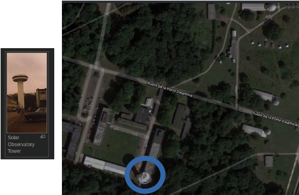

# Geolocating Images

Writeup to help you  solve [Geolocating Images Room](https://tryhackme.com/room/geolocatingimages) on [Tryhackme](https://tryhackme.com/)...awesome platform by the way.

## \[Task 1\] Getting Started

Download the file, extract the content. That's all....for now.

## \[Task 2\] Getting our feet wet - where is this?

Don't use Google Reverse, trust me and trust the creator, [Yandex](https://yandex.com/images/search) is way better for this, you could try with Google but the results you get won't be as good as Yandex.

Let's use Yandex's Image Reverse and see what we got.

Notice our first results is Karamay, if we Google Karamay we find out that is a City and, Where is located that City? \(I mean the country\). There you go that's your answer. 

## \[Task 3\] Geolocating Images 101

Just read, analyze and keep in mind all the techniques and the logic used by the author.

#### \[Task 4\] Now your turn

What do we can see on this image? Names Streets, we could try with "Sports Corner" but names streets are more useful.

* North Sheffield Avenue 
* West Addison Street

If we search bot Names Streets we can obtain the exact place where these streets get cross each other, the streets that we are looking for are in Chicago.

At this point we can use Street View also.

We can see the exact place photographed, but remember the answer is not the place that appears in the photograph, it is the place from where the photograph was taken. Navigate a bit with the Street View, change your perspective and you will get the answer.

## \[Task 5\] Helpful tips for geolocating

Just like Task 3 read, read very carefully and take notes of all the new techniques suggested.

## \[Task 6\] Your turn, again!

I have to say that this one was the most difficult for me but I like it. A special thanks to [Juss2](https://tryhackme.com/p/Juss2) because thanks to him I was able to find the place.

Let's try to mark some points of reference so, What do see here?

* The Eiffel Tower, at the back \(obviously\)
* One big build at the left
* Another big building at the right
* A river
* A couple of trees surrounding a "house" \(maybe\) 

So, what can we do with this? First let's try to guess the place where this image was taken.

By our previous analysis we know a couple of things. We know that there are three near the place so it should be like a park, we also know that this place is located near the river, with this information we can mark an area to study and snoop around \(I used Satellite view for this\).

After a couple of minutes snooping around and with a little of lucky I found this.

That's the place shown in our image, I tried to use Street View but no result, Street View wasn't available on that place. Second I tried to use Name Streets, nothing. Then I asked my self, Why Street View isn't available here?, this has to be some kind of private property. So I started to search the places near this location. It turns out that all these places are part of the Paris Observatory, that answer my question why Street View wasn't Available. 

All these constructions must be facilities of the Observatory, if we google "Paris Observatory Facilities" a Wikipedia came up, while I was reading I notice very interesting.

 The shape of that building, just look for the Facility where this tower is located and you will get the Answer.

## \[Task 7\] Your turn, what can you see?

As always,What can see on this one? Well, we have tremendous infomation:

* Marks on the road
* It's a live cam
* Those little yellows lights on crosswalks
* Monument at the back
* License Plate
* Drivers on the left side of the road

First lets try some searching with code on the license plate. Before Google the code lets try to reduce our search threshold. Where do people drives on the left side of the road? United Kingdom right? So I google "License Plate United Kingdom". The first result is Wikipedia, on that Wikipedia there is a section that explains how the codes on the license plates works.

If we use the code of our image London is the place so, Now that we know the city what can we do next? Let's try to use those crosswalks. I search for "crosswalks London".

The first thing I notice is that one the results contains those yellow lights on the crosswalks, but hey!!!. What's that on the left side of the capture? A woman walking on crosswalks, but look the marks on the road, they are the same ones that appear in our image, go to that result and you will get the answer.

## \[Task 8\] You're done!

Read that material.

And the last but not less important, be happy of the awesome investigation you have done. And if you use different techniques let me know.

